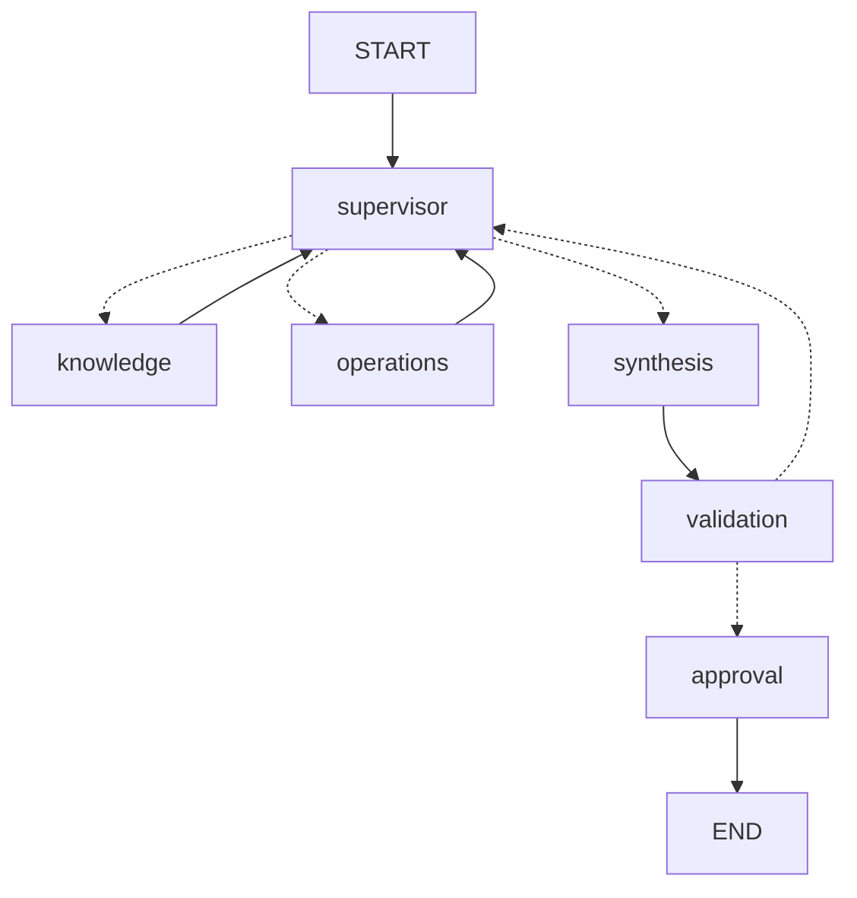

# SaaS Support Intelligence

Entrega final de AI Engineering: soporte para un SaaS ficticio de gestión de empresas,
inspirado en Rely. Consulta documentación, verifica casos de la cuenta autenticada
y propone tickets que requieren aprobación humana. No se conecta a Rely ni procesa
trámites, pagos o asesoramiento legal/fiscal.

## Ejecutar

Requiere Docker Compose y claves propias de OpenAI y LangSmith.

1. Copiar `.env.example` a `.env`.
2. Completar `OPENAI_API_KEY`, `LANGSMITH_API_KEY` y las cuatro credenciales locales
   `CUSTOMER_A_KEY`, `CUSTOMER_B_KEY`, `APPROVER_A_KEY`, `APPROVER_B_KEY`: distintas,
   aleatorias y de al menos 16 caracteres. Para generar cada una:
   `python -c "import secrets; print(secrets.token_urlsafe(32))"`.
3. Elegir `LLM_MODEL` y `EMBEDDING_MODEL`. El LLM debe soportar Responses API,
   herramientas y JSON Schema; la demo usa `gpt-6-luna` con
   `text-embedding-3-small`, 1536 dimensiones.
4. Ejecutar:

```sh
docker compose up -d --build
```

La ingesta se ejecuta antes de la API. Los documentos sin cambios no generan
embeddings nuevamente. Redis y Chroma conservan sus datos en volúmenes.
API: http://localhost:18080/docs · Salud: http://localhost:18080/health.
Detener sin borrar datos: `docker compose stop`.

## Uso

Autenticación: encabezado `X-API-Key`. Las credenciales determinan la cuenta
en el servidor; el usuario o el modelo no pueden elegirla. En Swagger, ingresarla
en **Authorize** antes de probar los endpoints.

| Operación | Endpoint |
| --- | --- |
| Abrir conversación | `POST /conversations` |
| Enviar consulta | `POST /conversations/{id}/messages` con `{"message":"¿Qué falta en CASE-101?"}` |
| Consultar resultado | `GET /jobs/{id}` |
| Aprobar/rechazar ticket | `POST /jobs/{id}/approve` con `{"approved":true}` o `false` |
| Leer ticket creado | `GET /tickets/{id}` |

Una consulta devuelve HTTP 202 con un job. Consultarlo hasta `DONE`, `FAILED`,
`REJECTED` o `WAITING_APPROVAL`. Solo la credencial de aprobador de la misma
cuenta puede reanudar un job en espera. No se crea ni envía un ticket antes.
Una conversación admite un job activo; una segunda consulta devuelve 409.
La cuenta A tiene `CASE-101` y `CASE-102`; la B tiene `CASE-201`.
Reutilizar el id de conversación permite continuar después de reiniciar la API.

## Flujo y responsabilidades



El diagrama refleja las aristas del `StateGraph`. El Supervisor decide la
delegación, no una clasificación manual de consultas. `knowledge` combina
embeddings en Chroma y BM25 con Reciprocal Rank Fusion; `operations` consulta
casos y prepara borradores con herramientas acotadas a la cuenta. Los pendientes
se calculan con datos, no con el LLM.

`state.py` conserva contribuciones separadas y contratos Pydantic. `validation`
rechaza citas inexistentes, casos/pendientes inconsistentes y tickets no preparados
por una herramienta. Permite un refinamiento y, si falla, pide aclaración.
Máximo: 8 decisiones del Supervisor, 4 llamadas por especialista y 180 segundos
por job. Los especialistas reciben su tarea y contexto acotado, no todo el estado.

`approval` utiliza `interrupt` y un checkpointer Redis asíncrono. La cola, los
locks y las transiciones son atómicos. Un worker perdido deja un error controlado;
no reintenta automáticamente una operación cuyo resultado podría ser ambiguo.
La creación de un ticket es idempotente por job. Si el proceso falla después de
crearlo, el job expone su `ticket_id` y `TICKET_CREATED_EXECUTION_INCOMPLETE` para
revisión; no oculta el ticket ni afirma que el flujo terminó correctamente.

## Verificación y trazas

Los tests no llaman proveedores: usan respuestas controladas en el límite del
LLM y Redis real para verificar delegación, reintentos de herramientas, validación,
aislamiento, aprobación, reinicio y errores posteriores a una escritura.

```powershell
py -3.12 -m venv .venv
.venv\Scripts\Activate.ps1
python -m pip install -r requirements-dev.txt
python -m pytest -q
```

En Linux/macOS, crear el entorno con `python3.12` y activar con
`source .venv/bin/activate`. Redis debe estar levantado;
`TEST_REDIS_URL` permite cambiar su dirección.

Con la API levantada y `.env` configurado, `python -m scripts.demo` ejecuta seis
escenarios reales por HTTP y guarda `evidence/demo.json`. Usa LLM/embeddings y tiene
costo: respuesta documentada, dos especialistas, memoria, abstención, aislamiento
y aprobación humana. Cada job incluye `trace_id`, rutas, herramientas y duraciones;
no contiene razonamiento privado del modelo. Para agregar la séptima prueba,
reiniciando únicamente el servicio local `api` y verificando la memoria persistente:

```sh
python -m scripts.demo --restart-api
```

El reinicio es opcional y solo admite una API en localhost.

Con `LANGSMITH_TRACING=true`, las trazas se envían a
`https://api.smith.langchain.com`, proyecto `saas-support-intelligence`.
`evidence/traces.json` registra la comprobación de la demo en LangSmith.

Verificación del 3 de octubre de 2026: **66 tests aprobados** y **7/7 escenarios
reales aprobados**, incluyendo la continuación de una conversación tras reiniciar
la API. Los tests también cubren claves inválidas, casos no encontrados y rechazo
de tickets sin creación.
La segunda ingesta informó `inserted=0, skipped=9, deleted=0`.
Las trazas se comprobaron por API; su vista web requiere iniciar sesión en LangSmith.

## Límites

Prototipo local reproducible: datos sintéticos, nueve documentos y tres casos.
Chunking de hasta 600 tokens con 80 de overlap; no se rellenan documentos cortos.
La validación estructural no demuestra por sí sola que toda frase sea verdadera.
La memoria mantiene seis mensajes recientes y el último código de caso; no es
memoria ilimitada. No hay UI, correo real, SSO, cuotas por usuario ni política de
retención. La API se publica solo en loopback, no directamente en Internet.
Antes de usar datos reales hacen falta autenticación corporativa, control de PII
en trazas, retención, evaluación del corpus y políticas de operación.
Chroma no ofrece cierre público de su transporte en esta versión: se cierran
los clientes de embeddings y el transporte de Chroma termina con el proceso.
Las claves, planes y documentos internos no forman parte del repositorio.
